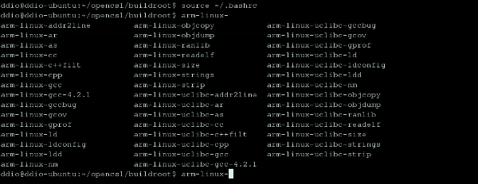

==============
Lab 1 環境設定
==============

.. 操作環境先以 Linux 為範例，完成八成草稿後，再加入 Windows 環境的操作範例。

OpenCSL 的意思是開放的電腦系統實驗教材（Computer System Lab course material），想要透過各種 open source 工具的使用來模擬嵌入式系統的開發環境，並提供對嵌入式系統有興趣的人一項入門的管道。

1. 實驗簡介
===========
在第一次實驗中，我們將介紹本實驗的環境、環境的相關設定，以及整套實驗的流程。

1.1 什麼是嵌入式系統？
----------------------
嵌入式系統是電腦系統的一種，和一般個人電腦不同的是，它通常是為了特定目的而設計的，而且只有有限的硬體資源可以使用，這些特性使得開發嵌入式系統比一般系統開發還要複雜。嵌入式系統的相關介紹可以參考 wikipedia [#]_ 。

.. [#] http://en.wikipedia.org/wiki/Embedded_system

1.2 實驗操作環境介紹
---------------------
在本套實驗中，我們使用軟體來模擬嵌入式系統的環境，希望對嵌入式系統有興趣的人能夠在自己的電腦上完成所有實驗。本套實驗使用的各項環境如下：

I.   作業系統：ubuntu 7.10
II.  模擬軟體：QEMU
III. toolchain：buildroot
IV.  模擬平台：ARM
V.   模擬的作業系統：Linux

1.3 實驗流程
--------------
本套實驗將以循序漸進的方式，逐步介紹開發嵌入式系統所需的知識及技術，並搭配 open source 工具來實做各個實驗。

I. Lab01 環境設定

  介紹實驗，以及準備實驗環境。

II. Lab02 製作 Linux Kernel

  這次實驗是在介紹如何製作作業系統的核心部份，內容包括了：介紹 Linux Kernel、介紹製作符合自己需求的 kernel ，並將 Linux 放在不同的 platform 上執行。

III. Lab03 製作 root filesystem

  此次實驗將介紹如何製作一個 filesystem ，使整個作業系統可以順利運行，內容包括了：介紹 root filesystem，以及製作搭配 Linux Kernel 的 root filesystem。

IV. Lab04 OS porting

  在已經有能力做出整個作業系統後，我們將介紹如何將作業系統 port 到目標的平台 [#]_ 上，讓 target 能夠順利啟動並進入作業系統中。這次實驗的內容包括了：介紹 bootloader 以及製作並使用 bootloader。

V. Lab05 debugger 和 software emulator

  本次實驗在介紹如何在對嵌入式系統進行除錯，內容包含了 GDB 以及 Insight 的使用教學。

VI. Lab06 Interrupt 和 Exceptions

  Interrupt 和 exception 是 Linux 裡程式互相溝通的方式之一，它可能由硬體產生，也有可能由軟體產生。本實驗將介紹 interrupt 和 exception 的觀念，並透過實做一個新的 system call 來更深入了解 Linux 的運作方式。

VII. Lab07 Linux Timer Interrupt

  Timer interrupt 是系統核心的一部分，它的出現頻率會和系統的效能有關。本實驗將介紹如何調整 linux kernel 中的 timer 以及了解其對系統的影響。

VIII. Lab08 Linux Device Driver

  由於嵌入式系統的多樣性，每個系統常常擁有和其他平台不同的裝置，也就需要額外的驅動程式才能控制裝置。本實驗將介紹兩種撰寫驅動程式的方法，以及學會在 linux 中使用額外裝置的方法。

.. [#] 在 porting 中，要 port 的目標平台叫做 target ，而負責處理、編譯系統的平台叫做 host。

2. 準備操作環境
===============

2.1 Ubuntu 7.10
---------------
Ubuntu [#]_  是由 Debian 的分支發展出來的一套 linux distribution，可以直接從官方網站 [#]_ 上下載到安裝/ 試用光碟。
若要安裝 Ubuntu 在電腦上，請至少預留2G的空間，供日後各程式原始碼、執行檔儲存。

.. [#] http://zh.wikipedia.org/wiki/Ubuntu
.. [#] http://www.ubuntu.org.tw/

2.2 QEMU
--------
QEMU 是一套 emulator [#]_ 軟體，能在 PC 系統上模擬其他 processor 的運作方式，在 Linux 或 Windows 上都能執行。
QEMU 的相關介紹可參考維基百科或是其官方網站 [#]_ 

.. [#] http://en.wikipedia.org/wiki/Emulator
.. [#] http://fabrice.bellard.free.fr/qemu 

2.2.1 在 Ubuntu 7.10 上安裝 QEMU
~~~~~~~~~~~~~~~~~~~~~~~~~~~~~~~~
QEMU的i386執行檔可以直接從官方網站上下載，或是直接下載原始碼來編譯。
若需下載原始碼，可開啟 Ubuntu 終端機視窗，並執行以下指令：

1. 安裝編譯時所須的套件
::

  sudo apt-get install gcc-3.4 libsdl1.2debian-all libsdl1.2-dev zlib1g-dev

2. 在欲安裝的目錄下，下載原始碼
::

  wget http://fabrice.bellard.free.fr/qemu/qemu-0.9.0.tar.gz

3. 解壓縮原始碼包裹
::

  tar zxf qemu-0.9.0.tar.gz

4. 編譯 QEMU
::

  cd qemu-0.9.0/
  ./configure --cc=/usr/bin/gcc-3.4 --host-cc=/usr/bin/gcc-3.4 --target-list=arm-softmmu
  make

經上述步驟，我們可以編譯出一個能夠執行 ARM 指令集的 QEMU emulator。

2.2.2 使用 QEMU
~~~~~~~~~~~~~~~
這裡透過使用 QEMU 官方網站上的 ARM-test disk image 來驗證 QEMU 否安裝正確

1. 下載 arm-test disk image
::

  wget http://fabrice.bellard.free.fr/qemu/arm-test-0.2.tar.gz

2. 解壓縮
::

  tar zxf arm-test-0.2.tar.gz

3. 用 QEMU 執行 disk image
::

  <QEMU>/arm-softmmu/qemu-system-arm -kernel <ARM_TEST>/zImage.integrator \
        -initrd <ARM_TEST>/arm_root.img -nographic -append "console=ttyAMA0"

.. note ::

  <QEMU>：存放 QEMU 目錄的路徑，如 ~/qemu-0.9.0/
  <ARM_TEST>：存放 arm-test 目錄的路徑

  -kernel：指定要載入的 linux kernel

  -initrd：指定要使用的 RAM disk

  -nographic -append "console=ttyAMA0"：關掉視窗介面

若在一連串開計畫面後有看到登入提示列，可用 root 登入，就代表 QEMU 編譯成功了。（如下圖）

.. image:: images/lab01_qemu.png

2.3 toolchain
-------------

toolchain 一套是用來製作程式的工具，它是由許多不同的工具構成，如 compiler 、 linker 等，關於 toolchain 的介紹可以參考維基百科 [#]_ 。 每一套 toolchain 都有不同的使用目的，而在嵌入式系統中，由於硬體資源（記憶體、計算能力）有限，我們常常無法在系統中安裝一套 toolchain ，取而代之的方法便是使用具有 cross compiler [#]_ 功能的 toolchain ，讓我們能夠直接在 host（硬體資源較充足的電腦，如個人電腦）上編譯出 target（想要開發的嵌入式系統）端能執行的程式。

Buildroot [#]_ 是一套基於 uClibc C library [#]_ ，用來編譯 cross-compilation toolchain/ filesystem 的程式組合，它能夠製作 cross-compilation toolchain ，讓我們能夠直接在 x86 平台上編譯出在 ARM 平台上執行的程式。在本系列實驗中，我們僅使用 buildroot 來製作 toolchain 。

.. [#] http://en.wikipedia.org/wiki/Toolchain / http://en.wikipedia.org/wiki/GNU_toolchain
.. [#] http://en.wikipedia.org/wiki/Cross_compiler
.. [#] http://buildroot.uclibc.org
.. [#] http://en.wikipedia.org/wiki/Uclibc

2.3.1 用 buildroot 製作 toolchain
~~~~~~~~~~~~~~~~~~~~~~~~~~~~~~~~~

1. 下載 buildroot 原始碼

   我們可以用 subversion [#]_ 直接下載 buildroot 原始碼。在終端機底下鍵入

   ::

     svn co -r 21163 svn://uclibc.org/trunk/buildroot

   就會在目前所在的目錄下建立一個叫做 buildroot 的資料夾，並將相關檔案從 buildroot 的 subversion 下載下來。

2. 更改 configure

   由於我們只需要製作一套 cross-compilation toolchain ，因此要先將 buildroot 的其他功能關掉。在 buildroot 的目錄下鍵入

   ::

     make menuconfig

  就可以進入 buildroot 的編輯選單，選單畫面如下：

  .. image:: images/lab01_buildroot.png

  接著，我們要將 target 改成 ARM ，並取消製作 filesystem 。

  I. 將 target 改成 ARM architechure
    
    將游標移至「Target Architechure」，並按 enter 進入選項，接著選擇「arm」，按下 enter 即可。

  II. 取消製作 filesystem

    在主選單中，進入「Target filesystem options」選項，並在「ext2 root filesystem」上按「n」以取消製作 ext2 root filesystem，接著按「->」，將游標移至「Exit」，並按下 enter 回到上一層選單。
    接著，在主選單中進入「Package  Selection for the target」中，按下 n 取消「Busybox」選項。

  III. 取消編譯 kernel

    接著，在回到主選單後，進入「Kernel」選項，再進入「Kernel type」選項，把 kernel type 選為「none」以取消製作 linux kernel 。

  IV. 擴充 toolchain 功能

    為了在往後能夠使用 NFS (Network filesystem)，需增加一些 toolchain 的功能。請在主選單中，進入「Toolchain」選項，並在底下找到一個「Enable RPC」，按下 y 即可選取。

  待調整完選項後回到主選單，按「->」，將游標移至「Exit」，即可存檔離開。

3. 製作 toolchain

   在設定完成之後，只要直接在 buildroot 的目錄上鍵入 make ，buildroot 就會製作 toolchain ，此時請記得讓電腦處在有網路連線的狀態，因為 buildroot 會到網路上抓一些需要的程式碼。

.. [#] http://en.wikipedia.org/wiki/Subversion_%28software%29

2.3.2 設定 toolchain
~~~~~~~~~~~~~~~~~~~~

等 buildroot 完成編譯後，我們可以在 build_arm/staging_dir/usr/bin 下找到我們在往後實驗中要使用的 toolchain ，他們全部是以 arm-linux-uclibc- 開頭，後面則是接著各個程式的功能，如 gcc 、 as 、 ld 等。

為了方便往後使用，我們可以設定 $PATH 參數，讓 bash shell 在搜尋可執行檔時也會搜尋這組編好的 toolchain 。假設 buildroot 的根目錄是 <buildroot> ，則在終端機鍵入

::
  
  export PATH=<buildroot>/build_arm/build_arm/staging_dir/usr/bin:$PATH

或是在家目錄的 .bashrc 中加入這一行指令，再用

::

  source ~/.bashrc

來載入 bash shell 的新設定。

當設定完成後，我們可以試著直接在終端機鍵入 arm-linux ，再按 tab ，就會直接列出我們剛編好的 toolchain 供選擇。

3. 參考資料
===========

3.1 Linux 版本狀況
-------------------

An extremely rushed history of the Linux kernel

======= =============
version released date
======= =============
0.01    Sep, 1991
1.0.0   Mar, 1994
1.2.0   Mar, 1995
2.0.0   Jun, 1996
2.2.0   Jan, 1999
2.4.0   Jan, 2001
2.6.0   Dec, 2003
2.6.14  Oct 27, 2005
2.6.15  Jan 2, 2006
2.6.16  Mar 19, 2006
2.6.17  Jun 17, 2006
2.6.18  Sep 19, 2006
2.6.19  Nov 29, 2006
2.6.20  Feb 4, 2007
2.6.21  Apr 21, 2007
2.6.22  Jul 8, 2007
2.6.23  Oct 9, 2007
======= =============

`Linux Kernel Version History`_ tracks all release records before year 2000.

.. _`Linux Kernel Version History`: http://ftp.cdut.edu.cn/pub2/linux/kernel/history/Master.html

4. 關於本文件
=============

本文件以 `reStructuredText`_ 格式編撰，並可使用 `docutils`_ 工具轉換成 `HTML`_ 或 LaTeX 各類格式。

.. _reStructuredText: http://docutils.sourceforge.net/rst.html
.. _docutils: http://docutils.sourceforge.net/
.. _HTML: http://www.hosting4u.cz/jbar/rest/rest.html
