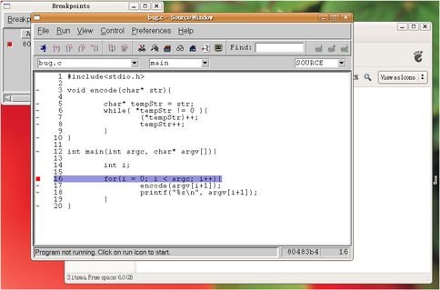
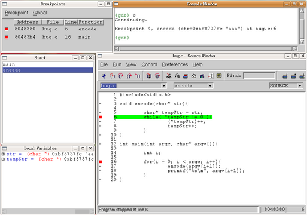

===================================
Lab 5 debugger 和 software emulator
===================================

.. contents:: 文件目錄
        :depth: 2

.. QEMU 的 debug 方式還沒研究

1. 實驗介紹
====================
本次實驗的目的是學會如何對程式進行除錯，無論程式是被編譯成在 target 還是 host 端執行。底下將分段介紹如何用 GDB 以及它的一套 GUI 程式來進行除錯。

1.1 GDB (GNU Debugger)
----------------------
GDB 是一套在 Unix-like 環境上執行的文字介面 debugger，能夠支援多種平台以及程式語言。和GDB相關的介紹請參考 wikipedia [#]_ 以及 GDB 官方網站 [#]_ 。

.. [#] http://en.wikipedia.org/wiki/Gdb 
.. [#] http://www.gnu.org/software/gdb/

1.2 Insight
-----------
Insight 是使用 GDB 的一套 GUI，關於 Insight 的介紹可以參考 Insight 官方網站 [#]_ 。

.. [#] http://sourceware.org/insight/

2. 使用 GDB
===========

.. 介紹基本功能，並給額外文件連結
.. 有空要介紹 multi-thread/multi-process debugging

2.1 安裝 GDB
------------
如果有依照之前的實驗進行，gdb應該已經安裝在電腦當中，我們可以用 whereis 指令來確認 gdb 是否存在。

::

  whereis gdb

若是gdb沒有安裝在電腦當中，可以使用 apt-get 來安裝gdb

::

  sudo apt-get install gdb

2.2 基本功能介紹
----------------
GDB將程式分成一個個的區塊（ frame ），每個 frame 都對應到程式的一個 subroutine ，在使用 GDB 執行程式時是依照 frame 來分塊的。目前執行的 subroutine 叫做 frame 0 ，呼叫該 routine 的叫做 frame 1 ，以此類推。當 frame 0 要呼叫下一個 subroutine 時， GDB 會將目前的資料存到 stack 中，然後才執行下一個 frame ，這樣的分法可以方便除錯時檢視各個 subroutine 之間的關係。

我們用一個簡單的程式來當作使用GDB除錯的範例。以下用C 寫的程式會將輸入的字串全部加 1以達到加密的目的。

::

  #include<stdio.h>

  char* encode(char* str){
  	char* tempStr = str;
  	while( *tempStr != 0 ){
  		(*tempStr)++;
  		tempStr++;
  	}
  }
  
  int main(int argc, char* argv[]){

  	int i;

  	for(i = 0; i < argc; i++){
  		encode(argv[i+1]);
  		printf("%s\n", argv[i+1]);
  	}
  }

.. note::
  以上程式碼可以在 opencsl 網站 http://opencsl.openfoundry.org 的「實驗相關檔案」下載。

2.2.1 用 GDB 執行程式（ set, show, run/r ）
~~~~~~~~~~~~~~~~~~~~~~~~~~~~~~~~~~~~~~~~~~~~
如果要用 GDB 來除錯，必須在編譯時加上 -g 參數，使 gcc 多加一些除錯資訊到程式中。

::
 
  gcc -g -o encode encode.c

在編譯完成後，就可以將程式用 GDB 來執行。

::

  gdb ./encode

當載入完成後，會出現 GDB 的命令列，此時可以用 set args 設定要丟給程式的參數，並用 show args 來檢查所下的參數。

::

  (gdb) set args abc osss
  (gdb) show args
  Argument list to give program being debugged when it is started is "abc osss".

接著就可以用 run 來執行程式。

::

  (gdb) run

在執行之後會看到 GDB 出現提示資訊，跟我們說程式因為 segmentation fault 而終止了，並且會提示導致 segmentation fault 的程式行號。

2.2.2 顯示程式碼 （ list/l ）
~~~~~~~~~~~~~~~~~~~~~~~~~~~~~
如果想要在使用 GDB 時檢視程式碼，可以直接在 GDB 裡用 list 指令，或是簡寫 l ，後面可以指定要顯示某一段程式碼，指定的方式可以是行號、函式名稱、檔案名稱或是程式的位址。
例如想要顯示 encode 這個函式到第15行的內容，可以打

::

  (gdb) list encode, 15

如果只給list一個參數，則會顯示那個參數代表的程式碼附近十行的程式。

如果想要繼續往後閱讀程式碼，只要再打一次 list 即可。
另外，「list - 」則可以印出前十行的程式碼。

2.2.3 設定中斷點並繼續執行（ breakpoint/break/b, continue/cont/c, next/n, step/s）
~~~~~~~~~~~~~~~~~~~~~~~~~~~~~~~~~~~~~~~~~~~~~~~~~~~~~~~~~~~~~~~~~~~~~~~~~~~~~~~~~~
在程式碼中插入中斷點可以使 GDB 不會一次把程式執行完，而會停在中斷點處。當程式被中斷時，我們可以使用 GDB 來讀取程式內變數、 CPU register 以及程式的其他資訊，本段先介紹如何設置中斷點以及逐步執行程式。

插入中斷點的指令是 breakpoint 或是簡寫 break、b ，後面可以加上參數指定行號、函式或是程式中的位址。當 GDB 執行遇到中斷點時，它會暫停在中斷點之前，也就是說，被設為中斷點的那行程式或函式就是下一個要執行的程式碼。例如我們可以透過以下指令將執行 encode() 前、後都設下中斷點：

::

  (gdb) b encode
  (gdb) b 10

第十行剛好是 encode 的結尾。

當設定好中斷點之後便可以用 run 開始執行程式，接著會發現 GDB 停在 encode() 的第一行程式碼，並且顯示它的參數。

::

  (gdb) set args abc osss
  (gdb) run
  Breakpoint 1, encode (str=0xbfef383c "abc") at bug.c:5
  5               char* tempStr = str;

此時，我們有三種方式可以選擇下一步的動作：

1. continue ，或是簡寫 cont、c 

   continue 的意思是繼續執行到下一個中斷點或是程式結束為止。

2. next ，或是簡寫 n

   next 是一次執行一行程式碼，當程式碼是呼叫函式時， GDB 只會把它視為一行程式碼。

3. step ，或是簡寫 s

   step 和 next 類似，但當碰到函式呼叫時， GDB 會進入函式中逐行執行。

以下示範三種不同方式的結果：

::

  Breakpoint 1, encode (str=0xbfef383c "abc") at bug.c:5
  5               char* tempStr = str;

  # 執行下一行程式碼
  (gdb) n
  6               while( *tempStr != 0 ){

  # 直接執行到下一個中斷點
  (gdb) c
  Continuing.

  Breakpoint 2, encode (str=0xbfef383c "bcd") at bug.c:10
  10      }

  # encode 結束，所以往下一行會跳回 main 裡的 printf
  (gdb) n
  main (argc=3, argv=0xbfef35a4) at bug.c:18
  18                      printf("%s\n", argv[i+1]);

  (gdb) n
  bcd
  16              for(i = 0; i < argc; i++){

  (gdb) s
  17                      encode(argv[i+1]);

  # 將要執行 encode ，選擇進入 encode 中逐步執行
  (gdb) s
  Breakpoint 1, encode (str=0xbfef3840 "osss") at bug.c:5
  5               char* tempStr = str;

值得注意的一點是，如果被呼叫的函式中有設定中斷點，即使是用 next 逐步執行， GDB 還是會跳到函式中。

2.2.4 讀取變數的值（ print/p, display）
~~~~~~~~~~~~~~~~~~~~~~~~~~~~~~~~~~~~~~~
當 GDB 停在中斷點，或是在逐步執行的過程中，我們可以透過 print 指令，或是簡寫 p 來讀取程式內變數的值。接續上面的例子，當程式停在第一個中斷點時，因為程式已經進到 encode() 的第一行，所以目前有效的變數只有 encode() 以及它的參數 str ，main()裡的參數因為不屬於此 frame ，所以無法讀取，而 tempStr 因為還未宣告，因此也是無效的，以下是程式停在 encode() 時使用 print 的情況：

::

  (gdb) p str
  $6 = 0xbf99683b "abc"

  (gdb) p encode
  $7 = {void (char *)} 0x8048374 <encode>

  # 尚未宣告的變數
  (gdb) p tempStr
  $8 = 0x1 <Address 0x1 out of bounds>

  # 不在此 frame 的變數
  (gdb) p argc
  No symbol "argc" in current context.

可以發現到 GDB 會幫每次 print 的變數都取一個暫存代號，我們可以直接選擇顯示這些代號的內容，或是用 $ 、 $$ 來分別表示前一個顯示的變數、前二個顯示的變數的值。

另外， print 也可以顯示陣列裡的部份內容，或是顯示不同的進位方式，如：

::

  # 從 str[0] 開始，顯示兩個元素
  (gdb) p str[0]@2
  $9 = "ab"

  # 用16進位方式顯示
  (gdb) p/x str[1]@2
  $10 = {0x62, 0x63}

如果不想要每次中斷時都重新用 print 來讀取自己想要看的值，可以用 display 設定在每次程式被中斷時想要顯示的資訊。 display 的設定方法和 print 相同，在這裡就不另外作示範。

2.2.5 查看程式資訊（ backtrace/bt, info ）
~~~~~~~~~~~~~~~~~~~~~~~~~~~~~~~~~~~~~~~~~~~~
當我們想要知道目前函式之間的呼叫狀態時，可以使用 backtrace 指令，或是簡稱 bt ，它能顯示目前 frame stack 的狀態，也可以在後面加上參數「 full 」來顯示每個 frame 裡的 local variavle 。

info 則是顯示各種 GDB 內設定、程式執行狀況的指令。目前設定的中斷點、 display ，或是 CPU registers 的內容都可以用這個指令辦到，如：

::

  # 顯示目前設定的中斷點
  (gdb) info b

  # 顯示目前設定的 display
  (gdb) info display

  # 顯示 eax 的值
  (gdb) info register eax

3. 使用 GDB 進行遠端除錯
==========================

除了在本機除錯之外，GDB 也可以透過網路對 target 端的程式進行除錯。

若要進行遠端除錯，我們需要編譯在 target 端執行的 gdbserver 以及在 host 端控制 gdbserver 的 gdb ，因為 gdbserver 的程式較原來的 gdb 簡單，因此通常 gdbserver 會比 gdb 本身還要容易 port 到 target 上去，但是在使用上又和原本的 gdb 相同。

3.1 編譯 arm-linux-uclibc-gdb 、 gdbserver
-------------------------------------------

1. 下載檔案以及建立資料夾

   首先要到 GDB 網站下載 gdb 原始碼：

   ::

     wget http://ftp.gnu.org/gnu/gdb/gdb-6.8.tar.bz2

   接著解開壓縮檔後並進入該目錄：

   ::

     tar xf gdb-6.8.tar.bz2
     cd gdb-6.8

   然後在 gdb 的根目錄底下建立供 gdb 以及 gdbserver 使用的目錄：

   ::

     mkdir gdb-host gdb-target

2. 編譯 host 端的 gdb 

   我們要先製作 gdb 的 configure 檔，再根據 configure 來編譯 gdb

   ::

     cd gdb-host
     ../configure --target=arm-linux-uclibc --prefix=$(pwd)

   接著再進行編譯即可產生 host 端使用的 gdb

   ::

     make
     make install

   在編譯完成後，可以在 gdb-6.8/gdb-host/bin/ 下發現 arm-linux-uclibc-gdb ，就是我們剛才製作出的 gdb。

3. 編譯 target 端的 gdbserver

   在編譯完 後，也是用類似的步驟編譯 gdbserver 。首先是產生 configure 檔

   ::

     cd ../gdb-target
     CC=arm-linux-uclibc-gcc  ../gdb/gdbserver/configure --host=arm-linux-uclibc --prefix=$(pwd)

   接著開啟 gdb-target/ 底下的 Makefile ，在大約 99 行的地方找到

   ::

     CFLAGS = -g -O2

   因為 target 端沒有編譯動態函式庫，因此要在它後面加上 -static ，使 gdbserver 不使用動態函式庫

   ::

     CFLAGS = -g -O2 -static

   最後再進行編譯即可。在編譯完成後可以在 gdb-6.8/gdb-target/ 下發現 gdbserver ，就是等一下要在 target 端直營的程式。

3.2 編譯測試程式
-----------------

我們需要編譯一個能夠在 target 端執行的程式，因此要使用 cross-compiler 以及加上 -static 參數。

以第二章所舉的 bug.c 為例：

::

  arm-linux-uclibc-gcc bug.c -o bug -static -g

3.3 進行遠端除錯
----------------

要進行遠端除錯的步驟如下：

1. 在 target 端用 gdbserver 開啟要除錯的程式，並監聽某一個 port 等 host 端的 gdb 連進來。

   進行此步驟前，請先用 QEMU 載入 linux kernel ，並切換到 gdbserver 和 bug 所在的目錄，就可以鍵入

   ::

     ./gdbserver 192.168.0.1:5566 bug

  .. note ::

    192.168.0.1 是 host 端的 IP

    5566 是 gdbserver 監聽的 port

    bug 是要偵錯的程式

2. 從 host 端連到 target 進行 debug

   在 host 端也用 gdb 執行同一個程式，在此還需要引入程式的理由是因為 gdbserver 只負責控制程式，但關於程式碼的內容等和程式執行本身的資訊還是由 gdb 自己負責。

   首先，先用 gdb 引入 bug

   ::

     arm-linux-uclibc-gdb bug

   接著，連線到 target 端

   ::

     target remote 192.168.0.2:5566

   即可用第二章所教的方法進行 debug 。

   .. note ::

      192.168.0.2 是 target 端的 IP

      5566 是 gdbserver 監聽的 port

4. 使用 Insight
===============

4.1 安裝 Insight
----------------
在 Ubuntu 中，我們可以直接透過套件管理程式來安裝 insight 。在終端機鍵入以下指令：

::

  sudo apt-get install insight

或是使用 synaptic 套件管理程式安裝。

在安裝完成後，在終端機鍵入

::

  insight

就會出現 Insight 的視窗介面。

.. image:: images/lab05_insight.png

4.2 基本功能介紹
----------------

在 Insight 視窗中可以看到各個對應 GDB 的指令，如 breakpoint 、 file ，甚至還可以直接跳回 GDB 使用純文字的介面（ ctrl + N ）。以下列出在本實驗中有介紹的 GDB 相關指令在 insight 中對應的快捷鍵：

==============    =================
GDB 指令           Insight 快捷鍵
==============    =================
breadpoint          ctrl + b
run                 r
continue            c
step                s
next                n
local variable      ctrl + n
==============    =================

例如按下 ctrl + b 之後就會可以設定中斷點， Insight 也會新增一個視窗來顯示目前所有中斷點的資訊。

4.3 用 Insight 除錯
-------------------
雖然 Insight 可以比較方便地設定一些功能，像是一次顯示所有 registers 、 stack 的狀況，但並無法使用 GDB 所有的功能，例如我們無法用 Insight 來設定 args （ set args ）以及環境變數，因此，比較好的方式是使用 Insight 附的文字介面再加上其他我們想要使用的功能，將視窗切割成很多個不同的區塊，如此一來，我們就可以一邊觀察目前程式執行的位址，一邊觀察所有變數的值，並很容易的設定中斷點，因為視窗介面讓我們可以比較容易找到想觀察的程式碼。

5. 延伸參考資料
===============

本實驗只對 GDB 作了最基本的介紹，但 GDB 其實還可以在其他的情況下除錯，如同時除錯 multi-thread / multi-process 的程式、對已經在執行的程式除錯等，另外，在除錯的過程中也可以使用更多的指令來提昇效率，如設定遇到中斷點時要執行哪些指令（ commands ）。以下提供一些關於 GDB 的教學網站，供有興趣的人自行參考學習。

- 完整版的 GDB 線上文件： http://dirac.org/linux/gdb

- 一些 GDB 的進階技巧： http://www.study-area.org/cyril/opentools/opentools/x1265.html

6. 關於本文件
=============

本文件以 `reStructuredText`_ 格式編撰，並可使用 `docutils`_ 工具轉換成 `HTML`_ 或 LaTeX 各類格式。

.. _reStructuredText: http://docutils.sourceforge.net/rst.html
.. _docutils: http://docutils.sourceforge.net/
.. _HTML: http://www.hosting4u.cz/jbar/rest/rest.html

